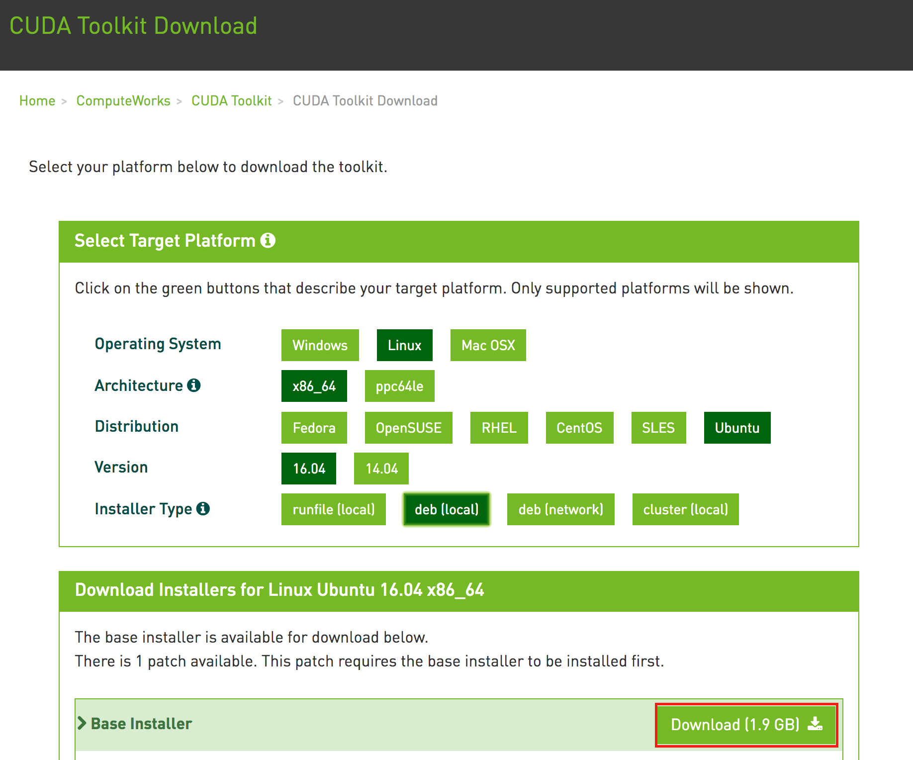

AWS/Google Cloud Ubuntu GPU acceleration guide for running Tensorflow Neural Networks
==============================================


### 1. [NVIDIA CUDA Toolkit](https://developer.nvidia.com/cuda-downloads)

{:class="img-responsive"}

Right-click, copy link address.

**Download, Rename and Install. (Rename because file extension in download is wrong as of current download version)**

```
wget https://developer.nvidia.com/compute/cuda/8.0/Prod2/local_installers/cuda-repo-ubuntu1604-8-0-local-ga2_8.0.61-1_amd64-deb
mv cuda-repo-ubuntu1604-8-0-local-ga2_8.0.61-1_amd64-deb cuda-repo-ubuntu1604-8-0-local-ga2_8.0.61-1_amd64.deb
sudo dpkg -i cuda-repo-ubuntu1604-8-0-local-ga2_8.0.61-1_amd64.deb
sudo apt-get update
sudo apt-get install cuda -y
```

### 2. [NVIDIA cuDNN](https://developer.nvidia.com/rdp/cudnn-download)


Register and download cuDNN v5.1 [here](https://developer.nvidia.com/rdp/cudnn-download) on local machine.

**AWS scp:**

```
scp -i '~/.ssh/aws_key_name.pem' ~/Downloads/cudnn-8.0-linux-x64-v5.1.tgz USER@AWS_IPv4_PUBLIC_IP_ADRESS:~
```

**Google Cloud scp:**

```
gcloud compute scp ~/Downloads/cudnn-8.0-linux-x64-v5.1.tgz INSTANCE_NAME:~
```

**Install (On cloud instance)**

```
tar -xzvf cudnn-8.0-linux-x64-v5.1.tgz  
sudo cp cuda/lib64/* /usr/local/cuda/lib64/  
sudo cp cuda/include/cudnn.h /usr/local/cuda/include/  
rm -rf ~/cuda  
rm cudnn-8.0-linux-x64-v5.1.tgz  
sudo apt-get update  
```

**Append lines to .bashrc**

Edit CUDA_VISIBLE_DEVICES variable according to number of GPUs on instace. '0' for 1 GPU core, '0,1' for 2 cores, '0,1,2,3' for 4, etc.

```
echo 'export CUDA_HOME=/usr/local/cuda' >> ~/.bashrc  
echo 'export PATH=$PATH:$CUDA_HOME/bin' >> ~/.bashrc  
echo 'export LD_LIBRARY_PATH=$LD_LIBRARY_PATH:$CUDA_HOME/lib64' >> ~/.bashrc
echo 'export CUDA_VISIBLE_DEVICES=0' >> ~/.bashrc  
source ~/.bashrc
```

### 3. Keras,tensorflow-gpu

**Install**

```
sudo pip install keras
sudo pip install tensorflow-gpu
```

**Restart Instance (OPTIONAL)**

```
sudo shutdown -r now
```

### 4. Verify Install

```
nvidia-smi
nvcc -V
cat /proc/driver/nvidia/version
pip show keras
pip show tensorflow-gpu
```


## Pre-requirements/Optional packages

### 1. [Anaconda](https://www.continuum.io/downloads)


**Install**

```
wget https://repo.continuum.io/archive/Anaconda3-4.4.0-Linux-x86_64.sh
bash Anaconda3-4.4.0-Linux-x86_64.sh
```

### 2. Jupyter Notebook Setup (after Anaconda Install)

**Generate config and cert files**

```
jupyter notebook --generate-config
mkdir certs
sudo openssl req -x509 -nodes -days 365 -newkey rsa:1024 -keyout mycert.pem -out mycert.pem
```

**Run in IPython shell**

```
ipython
from IPython.lib import passwd
passwd()
```

**Edit Jupyter Config File**

```
cd ~/.jupyter/
vim jupyter_notebook_config.py 
```

Copy generated output hash and enter into c.NotebookApp.password field then append following block of text at top of jupyter_notebook_config.py 

```
c = get_config()
c.IPKernelApp.pylab = 'inline'  # if you want plotting support always in your notebook
c.NotebookApp.certfile = u'/home/ubuntu/certs/mycert.pem' #location of your certificate file
c.NotebookApp.ip = '*'
c.NotebookApp.open_browser = False  #so that the ipython notebook does not opens up a browser by default
c.NotebookApp.password = u'sha1:98ff0e580111:12798c72623a6eecd54b51c006b1050f0ac1a62d'  #the encrypted password we generated above
c.NotebookApp.port = 8888
```

**SHIFT + Z + Z in vim to save**

**Start Jupyter Notebook**

```
source ~/.bashrc
cd ~
jupyter notebook
```

**AWS Jupyter Notebook Connect:**

If everything has been done correctly, access https://your-aws-public-ip-here:8888 from your browser and login using generated password

**Google Cloud Jupyter Notebook Connect:**

Pre-requisites include installing Google Cloud SDK for gcloud compute commands and .ssh folder keys setup.

```
ssh -i ~/.ssh/google_compute_engine -L 8899:localhost:8888 USERNAME@IPADDRESS
```

Where 8899 is the localhost port number.

Access https://localhost:8899 in local browser and login.
